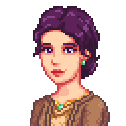
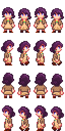

Diane is a history enthusiast who came to Pelican Town because of the growing museum collection. A lady of class and of heart. Diane spends most of her time at the museum but also enjoys exploring the valley.

 

## Contents
* [Relationships](#relationships)
* [Schedules](#schedules)
* [Gift Tastes](#gift-tastes)
* [Heart Events](#heart-events)
* [Movie Theater Tastes](#movie-theater-tastes)
  * [Movies](#movies)
  * [Concessions](#concessions)
* [Changelogs](#changelogs)
* [Notes](#notes)

## Relationships

Diane is married to Francesco, and even though they love each other and get along, they are unable to spend much of their time together. Diane knows wide range of people because of her background, but she thinks many of these connections are just mere surface-level. In Pelican Town, she mainly spends her time at the museum with Gunther and at other times watches over the children with Penny.

## Schedules
Diane visits Pelican Town on Monday, Tuesday, and Wednesday.

  
Monday and Wednesday

  <par>After seeing Diane's 10 heart event, Diane would stop visiting on Monday.</par>
  <table>
    <tr><th>Time</th><th>Location</th></tr>
    <tr><td>09.00</td><td>From inside the bus goes to stand in front of the flower near the saloon</td></tr>
    <tr><td>12.00</td><td>Goes to look at museum's collections</td></tr>
    <tr><td>14.00</td><td>Finds a corner to read inside the museum</td></tr>
    <tr><td>18.00</td><td>Goes to stand beside the river near the museum</td></tr>
    <tr><td>20.00</td><td>Goes to bus stop to catch a ride home</td></tr>
  </table>

  
Tuesday

  <table>
   <tr><th>Time</th><th>Location</th></tr>
   <tr><td>09.00</td><td>From inside the bus goes to the museum and read book while watching Penny tutors the children</td></tr>
   <tr><td>14.30</td><td>Goes to the bridge near the museum standing near Penny and the children</td></tr>
   <tr><td>16.00</td><td>Goes to stand near the fountain near community center</td></tr>
   <tr><td>20.00</td><td>Goes to bus stop to catch a ride home</td></tr>
  </table>

## Gift Tastes
This list excludes [universal gift tastes](https://stardewvalleywiki.com/Friendship#Universal_Gifts).

  
Loves

  <ul>
    <li><a href="https://stardewvalleywiki.com/Jade">Jade</a></li>
    <li><a href="https://stardewvalleywiki.com/Elvish_Jewelry">Elvish Jewelry</a></li>
    <li><a href="https://stardewvalleywiki.com/Ornamental_Fan">Ornamental Fan</a></li>
    <li><a href="https://stardewvalleywiki.com/Poppy">Poppy</a></li>
    <li><a href="https://stardewvalleywiki.com/Roasted_Hazelnuts">Roasted Hazelnuts</a></li>
  </ul>

  
Likes

  <ul>
    <li>All gems</li>
    <li><a href="https://stardewvalleywiki.com/Pearl">Pearl</a></li>
  </ul>

  
Neutrals

  <ul>
    <li>All vegetables</li>
    <li>All flowers</li>
    <li>All fruits</li>
    <li>All cooking except <a href="https://stardewvalleywiki.com/Roasted_Hazelnuts">Roasted Hazelnuts</a></li>
    <li>All fish</li>
    <li>All artisan goods</li>
    <li><a href="https://stardewvalleywiki.com/Rabbit%27s_Foot">Rabbit's Foot</a></li>
    <li><a href="https://stardewvalleywiki.com/Golden_Pumpkin">Golden Pumpkin</a></li>
  </ul>

  
Dislikes

  <ul>
    <li>All baits</a></li>
  </ul>

  
Hates

  <ul>
    <li><a href="https://stardewvalleywiki.com/Pufferfish">Pufferfish</a></li>
    <li><a href="https://stardewvalleywiki.com/Sea_Urchin">Sea Urchin</a></li>
  </ul>

## Heart Events
### Introduction
**New Fisherman in Town**

> [!WARNING]
> Only host player gets to trigger character introduction event.

After reaching level 10 fishing, enter bus stop on a sunny Friday or Saturday between 3pm and 6pm

Details

<par>
Player enters the bus stop and encounters cheerful Karl, who is on his way to the bus. Karl spots the player and offers an Iridium-quality carp from his day's catch. He mentions that the player can look forward to more encounters with him, as he would like to explore fishing spots around Stardew Valley.
</par>

### Two Hearts
**Little Friendly Feast**

On a sunny Friday or Saturday enter mountain between 3pm and 6pm

Details

<par>
Player enters the mountains and spot Karl and Linus sitting a campfire near Linus' tent. Karl notices and invites the player to join their small gathering. He's curious about what the player thinks of the roasted fish they're having. No matter the player's response, Karl says that the meal becomes even better when shared with new friends.
</par>

## Movie Theater Tastes
### Movies
Details on movies schedule can be seen on [movie theater wikipage](https://stardewvalleywiki.com/Movie_Theater#Movies)

  
Loves

  <ul>
    <li>The Zuzu City Express</li>
    <li>The Miracle At Coldstar Ranch</li>
    <li>It Howls In The Rain</li>
  </ul>

  
Likes

  <ul>
    <li>Natural Wonders: Exploring Our Vibrant World</li>
    <li>The Brave Little Sapling</li>
  </ul>

  
Dislikes

  <ul>
    <li>Journey Of The Prairie King: The Motion Picture</li>
    <li>Wumbus</li>
    <li>Mysterium</li>
  </ul>

### Concessions
Prices of concessions can be seen on [movie theater wikipage](https://stardewvalleywiki.com/Movie_Theater#Concessions)

  
Loves

  <ul>
    <li>Panzanella Salad</li>
    <li>Hummus Snack Pack</li>
    <li>Ice Cream Sandwich</li>
    <li>Truffle Popcorn</li>
    <li>Cappuccino Mousse Cake</li>
    <li>Stardrop Sorbet</li>
    <li>Salted Peanuts</li>
  </ul>

  
Likes

  <ul>
    <li>Cotton Candy</li>
    <li>Salmon Burger</li>
    <li>Apple Slices</li>
    <li>Chocolate Popcorn</li>
    <li>Popcorn</li>
    <li>Sour Slimes</li>
    <li>Star Cookie</li>
  </ul>

  
Dislikes

  <ul>
    <li>Nachos</li>
    <li>Personal Pizza</li>
    <li>Sour Slimes</li>
    <li>Fries</li>
    <li>Black Licorice</li>
    <li>Jasmine Tea</li>
    <li>Jawbreaker</li>
    <li>Joja Cola</li>
    <li>JojaCorn</li>
    <li>Kale Smoothie</li>
    <li>Rock Candy</li>
    
  </ul>

## Changelogs
* 1.0.0 initial release
 
## Notes
* Diane is one of the oldest character concept and her portraits has gone through multiple alterations.
