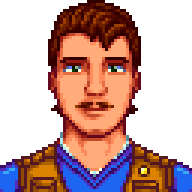
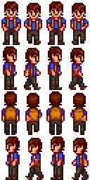

Karl is an office worker from Zuzu City. He comes to Pelican Town for some fishing, a hobby and a way to escape the bustling city life. He's a down-to-earth, hardworking man who is just trying to provide for his family. You can often spot him casting his line in the valley on Fridays and Saturdays.

 

## Contents
* [Relationships](#relationships)
* [Schedules](#schedules)
* [Gift Tastes](#gift-tastes)
* [Heart Events](#heart-events)
* [Movie Theater Tastes](#movie-theater-tastes)
  * [Movies](#movies)
  * [Concessions](#concessions)
* [Changelogs](#changelogs)
* [Notes](#Notes)

## Relationships

Karl resides in Zuzu alongside his wife, Emma. From his dialogues it appears that Emma does not share his loves for fishing. He generally gets along well with his co-workers, but despite his friendly demeanor, Karl is not particularly close to anyone except for Linus and Willy in Pelican Town.

## Schedules
Karl visits Pelican Town on Friday and Saturday.

  
Friday

  <par>After seeing Karl's 8 heart event, Karl would stop visiting on Friday.</par>
  <table>
    <tr><th>Time</th><th>Location</th></tr>
    <tr><td>15.00</td><td>From inside the bus goes to the beach's piers to fish</td></tr>
    <tr><td>19.00</td><td>Goes to bus stop to catch a ride home</td></tr>
  </table>

  
Saturday

  <par>Karl randomly chooses from the following schedules</par>
    
  <b>Fishing in Mountain and Visiting Linus</b>
  <table>
   <tr><th>Time</th><th>Location</th></tr>
   <tr><td>07.00</td><td>From inside the bus goes to stand near fireplace near Linus tent</td></tr>
   <tr><td>10.00</td><td>Goes to fish in mountain lake alternating between the lake island and west side of the lake</td></tr>
   <tr><td>16.00</td><td>Goes to stand near fireplace near Linus tent</td></tr>
   <tr><td>19.00</td><td>Goes to bus stop to catch a ride home</td></tr>
  </table>
  <b>Fishing in Town</b>
  <table>
    <tr><th>Time</th><th>Location</th></tr>
    <tr><td>07.00</td><td>From inside the bus goes to fish in town river near the top stream</td></tr>
    <tr><td>12.00</td><td>Goes to Stardrop Saloon</td></tr>
    <tr><td>15.30</td><td>Goes to fish in beach piers</td></tr>
    <tr><td>19.00</td><td>Goes to bus stop to catch a ride home</td></tr>
  </table>
  <b>Fishing with Willy</b>
  <table>
    <tr><th>Time</th><th>Location</th></tr>
    <tr><td>07.00</td><td>From inside the bus goes to fish in Cindersap Forest near Leah's Cottage</td></tr>
    <tr><td>13.30</td><td>Goes to fish in town</td></tr>
    <tr><td>17.00</td><td>Goes to stand near water in beach</td></tr>
    <tr><td>19.00</td><td>Goes to bus stop to catch a ride home</td></tr>
  </table>

## Gift Tastes
Excludes universal gift tastes

  
Loves

  <ul>
    <li><a href="https://stardewvalleywiki.com/Salmon_Dinner">Salmon Dinner</a></li>
    <li><a href="https://stardewvalleywiki.com/Sashimi">Sashimi</a></li>
    <li><a href="https://stardewvalleywiki.com/Fried_Calamari">Fried Calamary</a></li>
    <li><a href="https://stardewvalleywiki.com/Crispy_Bass">Crispy Bass</a></li>
    <li><a href="https://stardewvalleywiki.com/Beer">Beer</a></li>
    <li><a href="https://stardewvalleywiki.com/Mead">Mead</a></li>
    <li><a href="https://stardewvalleywiki.com/Pi%C3%B1a_Colada">Piña Colada</a></li>
    <li><a href="https://stardewvalleywiki.com/Ice_Cream">Ice Cream</a></li>
  </ul>

  
Likes

  <ul>
    <li>All eggs except <a href="https://stardewvalleywiki.com/Void_Egg">Void Egg</a></li>
    <li>All fish</li>
    <li><a href="https://stardewvalleywiki.com/Hardwood">Hardwood</a></li>
  </ul>

  
Neutrals

  <ul>
    <li>All vegetables</li>
    <li>All flowers</li>
    <li><a href="https://stardewvalleywiki.com/Rabbit%27s_Foot">Rabbit's Foot</a></li>
    <li><a href="https://stardewvalleywiki.com/Pearl">Pearl</a></li>
  </ul>

  
Dislikes

  <ul>
    <li><a href="https://stardewvalleywiki.com/Ginger">Ginger</a></li>
  </ul>

  
Hates

  <ul>
    <li><a href="https://stardewvalleywiki.com/Hot_Pepper">Hot Pepper</a></li>
  </ul>

## Heart Events
### Introduction Event
After reaching level 10 fishing, enter bus stop on a sunny day between 3pm and 6pm

> [!WARNING]
> Only host player gets to trigger character introduction event.

Details

<par>
Player enters the bus stop and sees a cheerful Karl on his way to the bus. Karl noticed the player and decided to gives player an Iridium quality carp.
</par>

### Two Hearts
On a sunny Friday or Saturday enter mountain between 4pm and 6pm

Details

<par>
Player enters mountain and sees Karl and Linus sitting in front of fireplace near Linus' tent. Upon noticing the player, Karl asks the player to join their little feast. He says that sharing the food with his new friends make the dish very tasty
</par>

### Four Hearts
On Friday or Saturday enter Cindersap Forest between 4pm and 6pm

Details

<par>
Player finds Karl fishing. Karl is startled leading to him losing the fish. He mentions he is just not quite in the game that day. He then explains that he had a rough week and can only find an escape when fishing. He then says after coming to Pelican Town he wonders if he should move. Player can give opinion on his idea.
</par>

## Movie Theater Tastes
### Movies
Details on movies schedule can be seen on [movie theater wikipage](https://stardewvalleywiki.com/Movie_Theater#Movies)

  
Loves

  <ul>
    <li>The Brave Little Sapling</li>
    <li>The Miracle At Coldstar Ranch</li>
    <li>Wumbus</li>
  </ul>

  
Likes

  <ul>
    <li>Journey Of The Prairie King: The Motion Picture</li>
    <li>It Howls In The Rain</li>
  </ul>

  
Dislikes

  <ul>
    <li>Mysterium</li>
    <li>Natural Wonders: Exploring Our Vibrant World</li>
    <li>The Zuzu City Express</li>
  </ul>

### Concessions
Prices of concessions can be seen on [movie theater wikipage](https://stardewvalleywiki.com/Movie_Theater#Concessions)

  
Loves

  <ul>
    <li>Fries</li>
    <li>Ice Cream Sandwich</li>
    <li>Nachos</li>
    <li>Personal Pizza</li>
    <li>Salmon Burger</li>
    <li>Stardrop Sorbet</li>
  </ul>

  
Likes

  <ul>
    <li>Panzanella Salad</li>
    <li>Apple Slices</li>
    <li>Cappuccino Mousse Cake</li>
    <li>Chocolate Popcorn</li>
    <li>Popcorn</li>
    <li>Sour Slimes</li>
    <li>Salted Peanuts</li>
    <li>Sour Slimes</li>
    <li>Truffle Popcorn</li>
  </ul>

  
Dislikes

  <ul>
    <li>Black Licorice</li>
    <li>Cotton Candy</li>
    <li>Hummus Snack Pack</li>
    <li>Jasmine Tea</li>
    <li>Jawbreaker</li>
    <li>Joja Cola</li>
    <li>JojaCorn</li>
    <li>Kale Smoothie</li>
    <li>Rock Candy</li>
    <li>Star Cookie</li>
  </ul>

