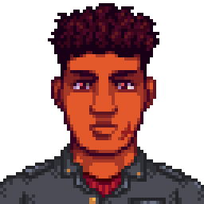
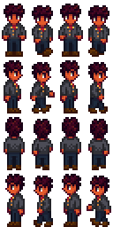

Paolo starts accompanying Diane after she caught herself needing some medical assistance. He takes the duty very seriously. Where there is Diane, there is Paolo. One would hope he would be able to appreciate Pelican Town the more time he spend on it.

 

## Contents

* [Relationships](#relationships)
* [Schedules](#schedules)
* [Gift Tastes](#gift-tastes)
* [Heart Events](#heart-events)
* [Movie Theater Tastes](#movie-theater-tastes)
  * [Movies](#movies)
  * [Concessions](#concessions)
* [Changelogs](#changelogs)
* [Notes](#notes)

## Relationships

Paolo has a daughter, Riri who is taken care of by her grandparents when Paolo is at work. He adores his daughter deeply. In Pelican Town, he appears to keep a distance to the town's residence and mostly focused on his duty to look after Diane.

## Schedules

Initially Paolo visits Pelican Town on Monday, Tuesday, and Wednesday where he is accompanying Diane. Later he would also visit on Saturday and Sunday.
> [!NOTE]
> After seeing Diane's ten hearts event, Paolo would also stop visiting on Monday.

  
Monday and Wednesday

  <par>Paolo follows Diane's schedules:</par>
   
  <b>Diane Museum Day</b>
  <table>
    <tr><th>Time</th><th>Location</th></tr>
    <tr><td>09.00</td><td>From inside the bus goes to look after Diane standing in front of the flower near the saloon</td></tr>
    <tr><td>12.00</td><td>Goes to look after Diane observing museum's collections</td></tr>
    <tr><td>14.00</td><td>Watches Diane reading inside the museum</td></tr>
    <tr><td>18.00</td><td>Goes to look after Diane standing beside the river near the museum</td></tr>
    <tr><td>20.00</td><td>Goes to bus stop to catch a ride home</td></tr>
  </table>
  <b>Diane Town Day</b>
  <table>
    <tr><th>Time</th><th>Location</th></tr>
    <tr><td>09.00</td><td>From inside the bus goes to look after Diane standing in the beach</td></tr>
    <tr><td>13.00</td><td>Goes to saloon for lunch</td></tr>
    <tr><td>16.00</td><td>Goes to look after Diane in town plaza</td></tr>
    <tr><td>20.00</td><td>Goes to bus stop to catch a ride home</td></tr>
  </table>

  
Tuesday

  <b>Diane Alongside the Children</b>
  <table>
   <tr><th>Time</th><th>Location</th></tr>
   <tr><td>09.00</td><td>From inside the bus goes to the museum and read book while watching Penny tutors the children</td></tr>
   <tr><td>14.30</td><td>Goes to the bridge near the museum standing near Penny and the children</td></tr>
   <tr><td>16.00</td><td>Goes to look after Diane standing near the fountain near community center</td></tr>
   <tr><td>20.00</td><td>Goes to bus stop to catch a ride home</td></tr>
  </table>

> [!NOTE]  
> If Diane is visiting on Rainy day, Paolo will use the following schedule instead of his usual schedule

  
Raining

  <b>Cooped Inside</b>
  <table>
   <tr><th>Time</th><th>Location</th></tr>
   <tr><td>09.00</td><td>From inside the bus goes to the museum and read book</td></tr>
   <tr><td>12.00</td><td>Goes to look after Diane observing museum's collections</td></tr>
   <tr><td>14.00</td><td>Goes to look after Diane in the counter talking with Gunther</td></tr>
   <tr><td>18.00</td><td>Goes to bus stop to catch a ride home</td></tr>
  </table>

> [!NOTE]
> After seeing Paolo's ten hearts event, Paolo and Riri would start visiting on Saturday.

  
Saturday

  <b>Play Time</b>
  <table>
   <tr><th>Time</th><th>Location</th></tr>
   <tr><td>09.00</td><td>From inside the bus goes to meet the town's children near the graveyard</td></tr>
   <tr><td>12.00</td><td>Goes to watch children play on the playground</td></tr>
   <tr><td>17.00</td><td>Goes to bus stop to catch a ride home</td></tr>
  </table>

> [!NOTE]
> After seeing Paolo's six hearts event, Paolo would start visiting on Saturday.

  
Sunday

  <b>Day of His Own</b>
  <table>
   <tr><th>Time</th><th>Location</th></tr>
   <tr><td>06.00</td><td>From inside the bus goes to the beach</td></tr>
   <tr><td>08.30</td><td>Goes to Pierre's shop</td></tr>
   <tr><td>10.00</td><td>Goes to workout in the bath house</td></tr>
   <tr><td>14.00</td><td>Goes to play pool in Saloon</td></tr>
   <tr><td>16.00</td><td>Goes to bus stop to catch a ride home</td></tr>
  </table>

## Gift Tastes

This list excludes [universal gift tastes](https://stardewvalleywiki.com/Friendship#Universal_Gifts).

  
Loves

  <ul>
    <li><a href="https://stardewvalleywiki.com/Spaghetti">Spaghetti</a></li>
    <li><a href="https://stardewvalleywiki.com/Hashbrown">Hashbrown</a></li>
    <li><a href="https://stardewvalleywiki.com/Pickles">Pickles</a></li>
    <li><a href="https://stardewvalleywiki.com/Ginger_Ale">Ginger Ale</a></li>
    <li><a href="https://stardewvalleywiki.com/Duck_Mayo">Duck Mayo</a></li>
  </ul>

  
Likes

  <ul>
    <li><a href="https://stardewvalleywiki.com/Mango">Mango</a></li>
    <li><a href="https://stardewvalleywiki.com/Coconut">Coconut</a></li>
  </ul>

  
Neutrals

  <ul>
    <li><a href="https://stardewvalleywiki.com/Prismatic_Shard">Prismatic Shard</a></li>
    <li><a href="https://stardewvalleywiki.com/Rabbit%27s_Foot">Rabbit's Foot</a></li>
  </ul>

  
Dislikes

  <ul>
    <li><a href="https://stardewvalleywiki.com/Blackberry">Blackberry</a></li>
  </ul>

  
Hates

  <ul>
    <li><a href="https://stardewvalleywiki.com/Tulip">Tulip</a></li>
    <li><a href="https://stardewvalleywiki.com/Mead">Mead</a></li>
  </ul>

## Heart Events

### Introduction

**Protecting the Lady**
 
After seeing Diane's six hearts event enter town map on a sunny Monday, Tuesday, or Wednesday between 9am and 4pm

Details

<par>
Player stands near the tree and sees Diane walks near Emily and Haley's house with Paolo following her. Jas and Vincent come running toward Diane and ask her to play, but Paolo quickly tells the kids to step back. Diane says she would be happy to accompany Jas and Vincent, and the children run off excitedly. Afther the children left Diane asks Paolo to tone it down.
</par>

### Two Hearts

**Overstepping**
 
Enter museum Monday, Tuesday, or Wednesday between 9am and 4pm

Details

<par>
Player overhears how Diane is angered by Paolo's "concern" over Diane and her husband relationship. Diane will storm off leaving the museum. Paolo notices the player and player can choose what to do.
</par>

### Six Hearts

**Growing Fondness**
 
Enter town map when it's not raining between 6pm and 9pm

Details

<par>
Player sees Paolo on his own crossing the bridge. Paolo stops and greets player telling that he gets here to fetch items from the town museum for Diane. He then look over the bridge and describe how the town feels different and that he heard there's a spa in the town. Paolo excuses himself and walk away.
  
Paolo will start visiting on Sunday after the event
  
After 10 days of the event Paolo will send a letter with Joja Cola attached. He writes that the drink is his favorite when taking a dip in the spa, followed by mention that player and him should visit the spa together sometime.
</par>

### Eight Hearts

**Bath Time Story**
 
Enter spa on Sunday 

Details

<par>
Player sees Paolo on his own crossing the bridge. Paolo stops and greets player telling that he gets here to fetch items from the town museum for Diane. He then look over the bridge and describe how the town feels different and that he heard there's a spa in the town. Paolo excuses himself and walk away.
  
Paolo will start visiting on Sunday after the event
  
After 10 days of the event Paolo will send a letter with Joja Cola attached. He writes that the drink is his favorite when taking a dip in the spa, followed by mention that player and him should visit the spa together sometime.
</par>

## Movie Theater Tastes

### Movies

Details on movies schedule can be seen on [movie theater wikipage](https://stardewvalleywiki.com/Movie_Theater#Movies)

  
Loves

  <ul>
    <li>Journey Of The Prairie King: The Motion Picture</li>
    <li>The Brave Little Sapling</li>
    <li>The Miracle At Coldstar Ranch</li>
  </ul>

  
Likes

  <ul>
    <li>It Howls In The Rain</li>
  </ul>

  
Dislikes

  <ul>
    <li>Wumbus</li>
    <li>Natural Wonders: Exploring Our Vibrant World</li>
    <li>The Zuzu City Express</li>
    <li>Mysterium</li>
  </ul>

### Concessions

Prices of concessions can be seen on [movie theater wikipage](https://stardewvalleywiki.com/Movie_Theater#Concessions)

  
Loves

  <ul>
    <li>Rock Candy</li>
    <li>Fries</li>
    <li>Nachos</li>
    <li>Stardrop Sorbet</li>
    <li>Salmon Burger</li>
    <li>Chocolate Popcorn</li>
    <li>Popcorn</li>
  </ul>

  
Likes

  <ul>
    <li>Jawbreaker</li>
    <li>Sour Slimes</li>
    <li>Truffle Popcorn</li>
    <li>Cotton Candy</li>
    <li>Cappuccino Mousse Cake</li>
    <li>Ice Cream Sandwich</li>
    <li>Salted Peanuts</li>
    <li>Apple Slices</li>
    <li>Sour Slimes</li>
    <li>Star Cookie</li>
  </ul>

  
Dislikes

  <ul>
    <li>Personal Pizza</li>
    <li>Black Licorice</li>
    <li>Jasmine Tea</li>
    <li>Joja Cola</li>
    <li>JojaCorn</li>
    <li>Kale Smoothie</li>
    <li>Panzanella Salad</li>
    <li>Hummus Snack Pack</li>
  </ul>

## Changelogs

* 1.0.0 initial release

## Notes

* Paolo's appearance is inspired by Rui Hachimura.
