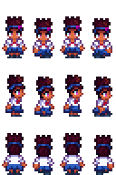

Karl is an office worker from Zuzu City. He comes to Pelican Town for some fishing, a hobby and a way to escape the bustling city life. He's a down-to-earth, hardworking man who is just trying to provide for his family. You can often spot him casting his line in the valley on Fridays and Saturdays.

 

## Contents

* [Relationships](#relationships)
* [Schedules](#schedules)
* [Gift Tastes](#gift-tastes)
* [Heart Events](#heart-events)
* [Movie Theater Tastes](#movie-theater-tastes)
  * [Movies](#movies)
  * [Concessions](#concessions)
* [Changelogs](#changelogs)
* [Notes](#notes)

## Relationships

Karl resides in Zuzu alongside his wife, Emma. From his dialogues it appears that Emma does not share his loves for fishing. He generally gets along well with his co-workers, but despite his friendly demeanor, Karl is not particularly close to anyone except for Linus and Willy in Pelican Town.

## Schedules

Riri visits Pelican Town on Saturday when it's not raining.

  
Saturday

  <b>Play Time</b>
  <table>
   <tr><th>Time</th><th>Location</th></tr>
   <tr><td>09.00</td><td>From inside the bus goes to meet the town's children near the graveyard</td></tr>
   <tr><td>12.00</td><td>Goes to play on the playground</td></tr>
   <tr><td>17.00</td><td>Goes to bus stop to catch a ride home</td></tr>
  </table>

## Gift Tastes

This list excludes [universal gift tastes](https://stardewvalleywiki.com/Friendship#Universal_Gifts).

  
Loves

  <ul>
    <li><a href="https://stardewvalleywiki.com/Salmon_Dinner">Salmon Dinner</a></li>
    <li><a href="https://stardewvalleywiki.com/Sashimi">Sashimi</a></li>
    <li><a href="https://stardewvalleywiki.com/Fried_Calamari">Fried Calamary</a></li>
    <li><a href="https://stardewvalleywiki.com/Crispy_Bass">Crispy Bass</a></li>
    <li><a href="https://stardewvalleywiki.com/Beer">Beer</a></li>
    <li><a href="https://stardewvalleywiki.com/Mead">Mead</a></li>
    <li><a href="https://stardewvalleywiki.com/Pi%C3%B1a_Colada">Piña Colada</a></li>
    <li><a href="https://stardewvalleywiki.com/Ice_Cream">Ice Cream</a></li>
  </ul>

  
Likes

  <ul>
    <li>All eggs except <a href="https://stardewvalleywiki.com/Void_Egg">Void Egg</a></li>
    <li>All fish</li>
    <li><a href="https://stardewvalleywiki.com/Hardwood">Hardwood</a></li>
  </ul>

  
Neutrals

  <ul>
    <li>All vegetables</li>
    <li>All flowers</li>
    <li><a href="https://stardewvalleywiki.com/Rabbit%27s_Foot">Rabbit's Foot</a></li>
    <li><a href="https://stardewvalleywiki.com/Pearl">Pearl</a></li>
  </ul>

  
Dislikes

  <ul>
    <li><a href="https://stardewvalleywiki.com/Ginger">Ginger</a></li>
  </ul>

  
Hates

  <ul>
    <li><a href="https://stardewvalleywiki.com/Hot_Pepper">Hot Pepper</a></li>
  </ul>

## Heart Events

### Two Hearts

**Little Friendly Feast**
 
On a sunny Friday or Saturday enter mountain between 3pm and 6pm

Details

<par>
Player enters the mountains and spot Karl and Linus sitting a campfire near Linus' tent. Karl notices and invites the player to join their small gathering. He's curious about what the player thinks of the roasted fish they're having. No matter the player's response, Karl says that the meal becomes even better when shared with new friends.
</par>

## Movie Theater Tastes

### Movies

Details on movies schedule can be seen on [movie theater wikipage](https://stardewvalleywiki.com/Movie_Theater#Movies)

  
Loves

  <ul>
    <li>The Brave Little Sapling</li>
    <li>It Howls In The Rain</li>
    <li>Wumbus</li>
  </ul>

  
Likes

  <ul>
    <li>Journey Of The Prairie King: The Motion Picture</li>
  </ul>

  
Dislikes

  <ul>
    <li>The Miracle At Coldstar Ranch</li>
    <li>Mysterium</li>
    <li>Natural Wonders: Exploring Our Vibrant World</li>
    <li>The Zuzu City Express</li>
  </ul>

### Concessions

Prices of concessions can be seen on [movie theater wikipage](https://stardewvalleywiki.com/Movie_Theater#Concessions)

  
Loves

  <ul>
    <li>Fries</li>
    <li>Ice Cream Sandwich</li>
    <li>Nachos</li>
    <li>Salmon Burger</li>
    <li>Stardrop Sorbet</li>
  </ul>

  
Likes

  <ul>
    <li>Personal Pizza</li>
    <li>Panzanella Salad</li>
    <li>Apple Slices</li>
    <li>Cappuccino Mousse Cake</li>
    <li>Chocolate Popcorn</li>
    <li>Popcorn</li>
    <li>Sour Slimes</li>
    <li>Salted Peanuts</li>
    <li>Sour Slimes</li>
    <li>Truffle Popcorn</li>
  </ul>

  
Dislikes

  <ul>
    <li>Black Licorice</li>
    <li>Cotton Candy</li>
    <li>Hummus Snack Pack</li>
    <li>Jasmine Tea</li>
    <li>Jawbreaker</li>
    <li>Joja Cola</li>
    <li>JojaCorn</li>
    <li>Kale Smoothie</li>
    <li>Rock Candy</li>
    <li>Star Cookie</li>
  </ul>

## Changelogs

* 1.0.0 initial release

## Notes

* Riri is cheerful and blunt in her speech
